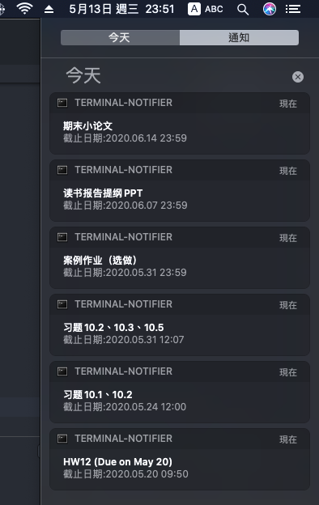

# MyCrawler

This is a small project that I built for practicing my python Selenium application skills. Also, It can help me handle some annoying daily tasks, such as checking school deadlines.

## How to use

Clone this repo and add `settings.py` in root directory.

```python
# settings.py

username = "username of Learning in ZJU"
password = "password of Learning in ZJU"
```

And use python to run `main.py`.

## Functions

1. Check Deadlines on Learning in ZJU

    
